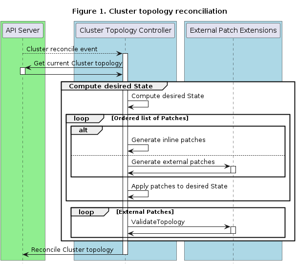

# Implementing Topology Mutation Hook Runtime Extensions

<aside class="note warning">

<h1>Caution</h1>

Please note Runtime SDK is an advanced feature. If implemented incorrectly, a failing Runtime Extension can severely impact the Cluster API runtime.

</aside>

## Introduction

Three different hooks are called as part of Topology Mutation - two in the Cluster topology reconciler and one in the ClusterClass reconciler.

**Cluster topology reconciliation**
* **GeneratePatches**: GeneratePatches is responsible for generating patches for the entire Cluster topology.
* **ValidateTopology**: ValidateTopology is called after all patches have been applied and thus allow to validate 
  the resulting objects.

**ClusterClass reconciliation**
* **DiscoverVariables**: DiscoverVariables is responsible for providing variable definitions for a specific ClusterClass.



Please see the corresponding [CAEP](https://github.com/kubernetes-sigs/cluster-api/blob/main/docs/proposals/20220330-topology-mutation-hook.md)
for additional background information.

## Inline vs. external patches

Inline patches have the following advantages:
* Inline patches are easier when getting started with ClusterClass as they are built into
  the Cluster API core controller, no external component have to be developed and managed. 

External patches have the following advantages:
* External patches can be individually written, unit tested and released/versioned.
* External patches can leverage the full feature set of a programming language and 
  are thus not limited to the capabilities of JSON patches and Go templating.
* External patches can use external data (e.g. from cloud APIs) during patch generation.
* External patches can be easily reused across ClusterClasses.

## External variables
The DiscoverVariables hook can be used to supply variable definitions for use in external patches. These variable definitions are added to
any applicable ClusterClasses. Clusters using the ClusterClass can then set values for those variables.

### External variable discovery in the ClusterClass
External variable definitions are discovered by calling the DiscoverVariables runtime hook. This hook is called from the ClusterClass reconciler.
Once discovered the variable definitions are validated and stored in ClusterClass status.

```yaml
apiVersion: cluster.x-k8s.io/v1beta1
kind: ClusterClass
# metadata
spec:
    # Inline variable definitions
    variables:
    - name: http-proxy
      schema:
        openAPIV3Schema:
          type: string
          default: "proxy.example.com"
          example: "proxy.example.com"
          description: "proxy for http calls."
    # External patch definitions.
    patches:
    - name: lbImageRepository
      external:
          generateExtension: generate-patches.k8s-upgrade-with-runtimesdk
          validateExtension: validate-topology.k8s-upgrade-with-runtimesdk
          ## Explicitly call variable discovery for this patch.
          variableDiscovery: variable-discovery.k8s-upgrade-with-runtimesdk
status:
    # observedGeneration is used to check that the current version of the ClusterClass is the same as that when the Status was previously written.
    # if metadata.generation isn't the same as observedGeneration Cluster using the ClusterClass should not reconcile.
    observedGeneration: xx
    # variables contains a list of all variable definitions, both inline and external, that belong to the ClusterClass.
    variables: 
        - name: http-proxy
          schema:
            openAPIV3Schema:
             type: string
             # default is different so this variable does not match the inline definition.
             default: "proxy.example3.com"
             example: "proxy.example.com"
             description: "proxy for http calls."
          # namespace is added as this variable's schema isn't equivalent to the inline definition.
          namespace: lbImageRepository
          # A variable can have multiple origins (altenate name /sources/??)
          # TODO: What purpose does this serve?
         # origins: 
         #  VariableDiscovery:
         #  - patch: lbImageRepository # not sure if to use this or variableDiscovery << to list
        - name: http-proxy
          schema:
          openAPIV3Schema:
            type: string
            default: "proxy.example.com"
            example: "proxy.example.com"
            description: "proxy for http calls."
          namespace: inline
```

### Variable namespacing
Variable definitions can be inline in the ClusterClass or from any number of external DiscoverVariables hooks.
If all variables that share a name have equivalent schemas the variables are considered to be in the global namespace.
Note: This is always the case if there is only one variable with a particular name.
The CAPI components will consider variable definitions to be equivalent when they share a name and `openAPIV3Schema` fields
excluding `description` and `example` are exactly equal. (TODO: Clarify this.)

If two or more variables which share a name do not have equivalent schemas, the variables will be namespaced. This means they will
appear namespaced in the ClusterClass `.status.variables` and setting values in the Cluster `.topology.spec.variables` will also require setting a namespace.
The namespace on a variable will depend on its source (TODO: RUNTIME_EXTENSION name or patch name?)
Note: When namespaced inline variables can be set without a namespace as they are always in the global namespace.

### Setting values for variables in the Cluster
Setting variables using external variables requires attention to be paid to variable namespacing, as exposed in the ClusterClass status. 
Variable values are set in Cluster `.spec.topology.variables`.

```yaml
apiVersion: cluster.x-k8s.io/v1beta1
kind: Cluster
#metadata 
spec:
    topology:
        variables:
        - name: http_proxy
          # If not defined or empty this variable is in the global namepsace.
          # is a list 
          namespaces: 
            - lbImageRepository
            - inline
          value: "proxy.example2.com"
```
## Using one or multiple external patch extensions

Some considerations:
* In general a single external patch extension is simpler than many, as only one extension 
  then has to be built, deployed and managed.
* A single extension also requires less HTTP round-trips between the CAPI controller and the extension(s).
* With a single extension it is still possible to implement multiple logical features using different variables.
* When implementing multiple logical features in one extension it's recommended that they can be conditionally
  enabled/disabled via variables (either via certain values or by their existence).
* [Conway's law](https://en.wikipedia.org/wiki/Conway%27s_law) might make it not feasible in large organizations 
  to use a single extension. In those cases it's important that boundaries between extensions are clearly defined.

## Guidelines

For general Runtime Extension developer guidelines please refer to the guidelines in [Implementing Runtime Extensions](implement-extensions.md#guidelines).
This section outlines considerations specific to Topology Mutation hooks:

### Patch extension guidelines
* **Input validation**: An External Patch Extension must always validate its input, i.e. it must validate that
  all variables exist, have the right type and it must validate the kind and apiVersion of the templates which
  should be patched.
* **Timeouts**: As External Patch Extensions are called during each Cluster topology reconciliation, they must
  respond as fast as possible (&lt;=200ms) to avoid delaying individual reconciles and congestion.
* **Availability**: An External Patch Extension must be always available, otherwise Cluster topologies won’t be
  reconciled anymore.
* **Side Effects**: An External Patch Extension must not make out-of-band changes. If necessary external data can
  be retrieved, but be aware of performance impact.
* **Deterministic results**: For a given request (a set of templates and variables) an External Patch Extension must
  always return the same response (a set of patches). Otherwise the Cluster topology will never reach a stable state.
* **Idempotence**: An External Patch Extension must only return patches if changes to the templates are required,
  i.e. unnecessary patches when the template is already in the desired state must be avoided.
* **Avoid Dependencies**: An External Patch Extension must be independent of other External Patch Extensions. However
  if dependencies cannot be avoided, it is possible to control the order in which patches are executed via the ClusterClass.
* **Error messages**: For a given request (a set of templates and variables) an External Patch Extension must
  always return the same error message. Otherwise the system might became unstable due to controllers being overloaded
  by continuous changes to Kubernetes resources as these messages are reported as conditions. See [error messages](implement-extensions.md#error-messages).

### Variable discovery guidelines
* **Unique variable names**: When using external variable discovery, care should be taken to ensure that variable names are unique.
  If the names are not unique the ClusterClass controller will attempt to deduplicate variables by comparing their definition. If this
  is not possible the variables will be namespaced and must be referenced by their namespace when defined in a Cluster.
* **Avoid updating variable definitions**: When using external variables updating the definitions of variables in use by existing Clusters
  can cause reconciliation to fail where existing variable values are no longer valid, or where changing the definitions results in namespacing of
  variables which were previously not namespaced.

## Definitions

### GeneratePatches

A GeneratePatches call generates patches for the entire Cluster topology. Accordingly the request contains all
templates, the global variables and the template-specific variables. The response contains generated patches.

#### Example request:

* Generating patches for a Cluster topology is done via a single call to allow External Patch Extensions a
  holistic view of the entire Cluster topology. Additionally this allows us to reduce the number of round-trips.
* Each item in the request will contain the template as a raw object. Additionally information about where
  the template is used is provided via `holderReference`.

```yaml
apiVersion: hooks.runtime.cluster.x-k8s.io/v1alpha1
kind: GeneratePatchesRequest
variables:
- name: <variable-name>
  value: <variable-value>
  ...
items:
- uid: 7091de79-e26c-4af5-8be3-071bc4b102c9
  holderReference:
    apiVersion: cluster.x-k8s.io/v1beta1
    kind: MachineDeployment
    namespace: default
    name: cluster-md1-xyz
    fieldPath: spec.template.spec.infrastructureRef
  object:
    apiVersion: infrastructure.cluster.x-k8s.io/v1beta1
    kind: AWSMachineTemplate
    spec:
    ...
  variables:
  - name: <variable-name>
    value: <variable-value>
    ...
```

#### Example Response:

* The response contains patches instead of full objects to reduce the payload.
* Templates in the request and patches in the response will be correlated via UIDs.
* Like inline patches, external patches are only allowed to change fields in `spec.template.spec`.

```yaml
apiVersion: hooks.runtime.cluster.x-k8s.io/v1alpha1
kind: GeneratePatchesResponse
status: Success # or Failure
message: "error message if status == Failure"
items:
- uid: 7091de79-e26c-4af5-8be3-071bc4b102c9
  patchType: JSONPatch
  patch: <JSON-patch>
```

For additional details, you can see the full schema in <button onclick="openSwaggerUI()">Swagger UI</button>.

We are considering to introduce a library to facilitate development of External Patch Extensions. It would provide capabilities like:
* Accessing builtin variables
* Extracting certain templates from a GeneratePatches request (e.g. all bootstrap templates)

If you are interested in contributing to this library please reach out to the maintainer team or
feel free to open an issue describing your idea or use case.

### ValidateTopology

A ValidateTopology call validates the topology after all patches have been applied. The request contains all 
templates of the Cluster topology, the global variables and the template-specific variables. The response
contains the result of the validation.

#### Example Request:

* The request is the same as the GeneratePatches request except it doesn't have `uid` fields. We don't
  need them as we don't have to correlate patches in the response.

```yaml
apiVersion: hooks.runtime.cluster.x-k8s.io/v1alpha1
kind: ValidateTopologyRequest
variables:
- name: <variable-name>
  value: <variable-value>
  ...
items:
- holderReference:
    apiVersion: cluster.x-k8s.io/v1beta1
    kind: MachineDeployment
    namespace: default
    name: cluster-md1-xyz
    fieldPath: spec.template.spec.infrastructureRef
  object:
    apiVersion: infrastructure.cluster.x-k8s.io/v1beta1
    kind: AWSMachineTemplate
    spec:
    ...
  variables:
  - name: <variable-name>
    value: <variable-value>
    ...
```

#### Example Response:

```yaml
apiVersion: hooks.runtime.cluster.x-k8s.io/v1alpha1
kind: ValidateTopologyResponse
status: Success # or Failure
message: "error message if status == Failure"
```

For additional details, you can see the full schema in <button onclick="openSwaggerUI()">Swagger UI</button>.

<script>
// openSwaggerUI calculates the absolute URL of the RuntimeSDK YAML file and opens Swagger UI.
function openSwaggerUI() {
  var schemaURL = new URL("runtime-sdk-openapi.yaml", document.baseURI).href
  window.open("https://editor.swagger.io/?url=" + schemaURL)
}
</script>

### DiscoverVariables

A DiscoverVariables call returns definitions for one or more variables. This variable definition is the same as that used for inline variables.

Example variable definition:

```yaml
  - name: etcdImageTag # name of the variable
    required: true # whether the variable must be defined for Clusters.
    schema:
      openAPIV3Schema: 
        type: string 
        default: "3.5.3-0" # variable value which is defaulted during reconciliation if not defined elsewhere.
        example: "3.5.3-0" # example for user guidance.
        description: "etcdImageTag sets the tag for the etcd image." #description of variable use.
        # Additional fields from clusterv1.JSONSchemaProps
```

#### Example Request:

* The request is a simple request which contains the name and namespace of the ClusterClass it is called for.
TODO: Should this send the full ClusterClass?

```yaml
apiVersion: hooks.runtime.cluster.x-k8s.io/v1alpha1
kind: DiscoverVariablesRequest
clusterClass:
- name: <clusterClass-name>
  namespace: <clusterClass-namespace>
```

#### Example Response:

```yaml
apiVersion: hooks.runtime.cluster.x-k8s.io/v1alpha1
kind: DiscoverVariablesResponse
status: Success # or Failure
variables:
  - name: etcdImageTag 
    required: true
    schema:
      openAPIV3Schema:
        type: string
        default: "3.5.3-0" 
        example: "3.5.3-0"
        description: "etcdImageTag sets the tag for the etcd image."
  - name: preLoadImages
    required: false
    schema:
      openAPIV3Schema:
        default: []
        type: array
        items:
          type: string
        description: "preLoadImages sets the images for the docker machines to preload."
  - name: podSecurityStandard
    required: false
    schema:
      openAPIV3Schema:
        type: object
        properties:
          enabled:
            type: boolean
            default: true
            description: "enabled enables the patches to enable Pod Security Standard via AdmissionConfiguration."
          enforce:
            type: string
            default: "baseline"
            description: "enforce sets the level for the enforce PodSecurityConfiguration mode. One of privileged, baseline, restricted."
          audit:
            type: string
            default: "restricted"
            description: "audit sets the level for the audit PodSecurityConfiguration mode. One of privileged, baseline, restricted."
          warn:
            type: string
            default: "restricted"
            description: "warn sets the level for the warn PodSecurityConfiguration mode. One of privileged, baseline, restricted."
...
```

For additional details, you can see the full schema in <button onclick="openSwaggerUI()">Swagger UI</button>.
TODO: Add openAPI definition to the SwaggerUI
<script>
// openSwaggerUI calculates the absolute URL of the RuntimeSDK YAML file and opens Swagger UI.
function openSwaggerUI() {
  var schemaURL = new URL("runtime-sdk-openapi.yaml", document.baseURI).href
  window.open("https://editor.swagger.io/?url=" + schemaURL)
}
</script>


## Dealing with Cluster API upgrades with apiVersion bumps

There are some special considerations regarding Cluster API upgrades when the upgrade includes a bump
of the apiVersion of infrastructure, bootstrap or control plane provider CRDs.

When calling external patches the Cluster topology controller is always sending the templates in the apiVersion of the references
in the ClusterClass.

While inline patches are always referring to one specific apiVersion, external patch implementations are more flexible. They can
be written in a way that they are able to handle multiple apiVersions of a CRD. This can be done by calculating patches differently
depending on which apiVersion is received by the external patch implementation.

This allows users more flexibility during Cluster API upgrades:

Variant 1: External patch implementation supporting two apiVersions at the same time

1. Update Cluster API
2. Update the external patch implementation to be able to handle custom resources with the old and the new apiVersion
3. Update the references in ClusterClasses to use the new apiVersion

**Note** In this variant it doesn't matter if Cluster API or the external patch implementation is updated first.

Variant 2: Deploy an additional instance of the external patch implementation which can handle the new apiVersion

1. Upgrade Cluster API
2. Deploy the new external patch implementation which is able to handle the new apiVersion
3. Update ClusterClasses to use the new apiVersion and the new external patch implementation
4. Remove the old external patch implementation as it's not used anymore

**Note** In this variant it doesn't matter if Cluster API is updated or the new external patch implementation is deployed first.
